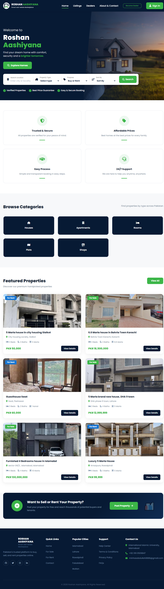
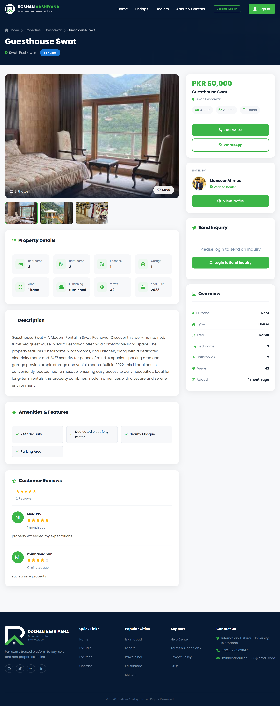
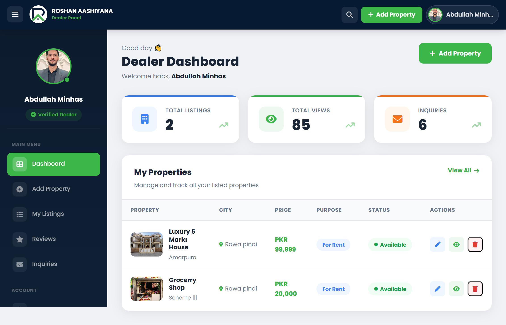
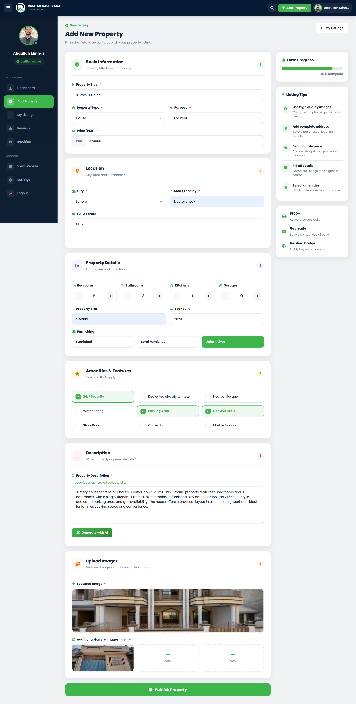
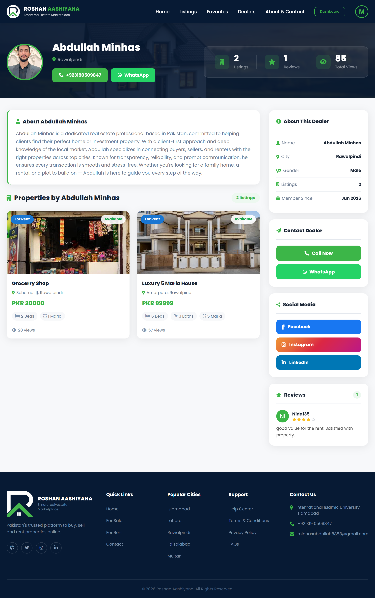

# Roshan Aashiyana — Smart Real Estate Marketplace

<div align="center">


### Pakistan's AI-Powered Real Estate Platform

A full-stack web application connecting property buyers, renters, and verified dealers across major cities in Pakistan — with AI-generated listings, Stripe payments, and real-time email notifications.

<br>

[](https://roshanaashiyana.xyz)
[](https://djangoproject.com)
[](https://python.org)
[](https://neon.tech)
[](https://railway.app)

</div>

---

## Screenshots

| | | |
|---|---|---|
|  |  |  |
| **Homepage** | **Property Listings** | **Property Detail** |
|  |  |  |
| **Dealer Dashboard** | **AI Description Generator** | **Dealer Profile** |

---

## Features

**For Buyers & Users**
- Email verification on signup
- Advanced property search — filter by city, type, purpose, price, bedrooms, keyword
- Save favourite properties
- Send inquiries directly to dealers
- Leave reviews and ratings
- Forgot password and reset password flow
- Change username and password from account menu

**For Dealers**
- One-time registration with Stripe payment
- Full property management — add, edit, delete listings
- AI-powered description generator using Mistral AI
- Inquiry management with automated email notifications
- Profile settings — bio, contact info, social media links
- Dashboard analytics — total views and inquiries
- Public dealer profile page

**Technical**
- CSRF protection on all forms
- Secure password hashing via Django auth
- Email verification before account activation
- Stripe payment verification on dealer registration
- Cloudinary for image storage
- HTML email templates via Resend API

---

## Tech Stack

| Layer | Technology |
|---|---|
| Backend | Django 6.0, Python 3.13 |
| Database | PostgreSQL (Neon) |
| Frontend | HTML5, CSS3, Vanilla JavaScript |
| Image Storage | Cloudinary |
| Payments | Stripe Checkout |
| Email | Resend API |
| AI | Mistral AI + LangChain |
| Deployment | Railway |
| Static Files | WhiteNoise |
| Web Server | Gunicorn |

---

## How the AI Generator Works

Dealers can auto-generate professional property descriptions in one click.

1. Dealer fills in property details — title, price, city, rooms, features
2. Clicks **Generate with AI**
3. LangChain formats all data into a structured prompt
4. Mistral AI generates an 80-120 word professional description
5. Description auto-fills in the textarea instantly

```python
# ghr/agent.py
from langchain_mistralai import ChatMistralAI
from langchain_core.prompts import ChatPromptTemplate

def generate_description(data: dict) -> str:
    llm = ChatMistralAI(model='mistral-small-latest', temperature=0)
    chain = prompt | llm
    return chain.invoke(data).content.strip()
```

---

## Email Notifications

All emails are sent as branded HTML via Resend API.

| Event | Email |
|---|---|
| User signup | Email verification link |
| Email verified | Welcome email |
| Dealer registered | Account created confirmation |
| Inquiry submitted | Notification to dealer |
| Forgot password | Password reset link |

---

## Database Structure

```
User (Django built-in)
├── Dealer (OneToOne)
│   └── Property (ForeignKey)
│       ├── PropertyImage (ForeignKey)
│       ├── Features (ManyToMany)
│       ├── DealerReview (ForeignKey)
│       └── Inquiry (ForeignKey)
├── Favorite (ForeignKey)
└── ContactMessage
```

---

## Getting Started

### Requirements
- Python 3.13+
- PostgreSQL (or Neon free tier)
- Cloudinary account
- Stripe account
- Resend account
- Mistral AI API key

### Installation

```bash
# Clone the repo
git clone https://github.com/MinhasAbdullah/roshan-aashiyana.git
cd roshan-aashiyana

# Create and activate virtual environment
python -m venv venv
venv\Scripts\activate        # Windows
source venv/bin/activate     # Mac/Linux

# Install dependencies
pip install -r requirements.txt

# Set up environment variables
cp .env.example .env
# Fill in your credentials in .env

# Run migrations
python manage.py migrate

# Create admin user
python manage.py createsuperuser

# Start server
python manage.py runserver
```

### Environment Variables

```env
SECRET_KEY=your_django_secret_key
DEBUG=True

DATABASE_URL=your_neon_postgresql_url

CLOUDINARY_CLOUD_NAME=your_cloud_name
CLOUDINARY_API_KEY=your_api_key
CLOUDINARY_API_SECRET=your_api_secret

STRIPE_PUBLIC_KEY=your_stripe_public_key
STRIPE_SECRET_KEY=your_stripe_secret_key

RESEND_API_KEY=your_resend_api_key

MISTRAL_API_KEY=your_mistral_api_key
```

---

## Project Structure

```
roshan-aashiyana/
│
├── ghr/                      # Main Django app
│   ├── migrations/           # Database migrations
│   ├── static/               # CSS, JS, Images
│   ├── templates/            # HTML templates
│   ├── models.py             # Database models
│   ├── views.py              # View functions
│   ├── urls.py               # URL patterns
│   └── agent.py              # Mistral AI agent
│
├── myproject/                # Django settings
│   ├── settings.py
│   ├── urls.py
│   └── wsgi.py
│
├── screenshots/              # README screenshots
├── requirements.txt
├── Procfile
├── .env.example
└── manage.py
```

---

## Deployment

Deployed on Railway with the following configuration:

- **Build Command:** `python manage.py collectstatic --noinput`
- **Start Command:** `gunicorn myproject.wsgi --bind 0.0.0.0:$PORT`
- **Database:** Neon PostgreSQL
- **Media Files:** Cloudinary
- **Static Files:** WhiteNoise

---

## Author

**Abdullah Minhas**

[](https://www.linkedin.com/in/abdullah-minhas-6798b932a/)
[](https://github.com/MinhasAbdullah)
[](https://roshanaashiyana.xyz)

---

<div align="center">
  <sub>Built with Django · Deployed on Railway · Powered by Mistral AI</sub>
</div>
